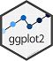

# Visualiser {#visualiser}


ggplot2 er en R-pakke fra tidyverse. Dens popularitet ligger i enkelheden ved at tilpasse grafer og fjerne eller ændre komponenter i et plot på et højt abstraktionsniveau.

Tjek denne bog, hvis du er interesseret i at lære mere - Datavisualisering i R Med ggplot2

Syntaks for plottning i ggplot2 følger en enkel metode til opbygning af grafer.

* Data
* Variabler
* Plot type - det er her du definerer plottypen
* Ekstra lag til tilpasning - titel, etiketter, akser osv.

En typisk struktur;

```{r eval=FALSE}
ggplot(data = Example_Data) +
       aes(x = Variable_1, y = Variable_2) +
       geom_bar()   #this is an example of a bar plot sysntax
```


**Plot ggplot2 - Is salg**

```{r eval=FALSE}
ggplot(data=issalg) +
  geom_point(mapping = aes(x=Temperatur, y=Salg, color=Butik_Placering, size=Salg)) +
  geom_smooth(mapping = aes(x=Temperatur, y=Salg, color=Butik_Placering), se=FALSE) +
  geom_hline(yintercept = mean(issalg$Salg)) +
  annotate("text", label="Middel Salg", x=15, vjust = 0, y=mean(issalg$Salg+200)) +
  geom_vline(xintercept = mean(issalg$Temperatur)) +
  annotate("text", label="Middel Temperatur", y=100, hjust = 0, x=mean(issalg$Temperatur-0.5), angle = 90) +
  theme(panel.background = element_blank()) +
  theme(plot.background = element_blank()) +
  scale_x_continuous(name="Temperatur") +
  scale_y_continuous(name="Total Salg") +
  scale_color_discrete(name="Placering af butiken") +
  scale_size_continuous(name="Salg") +
  theme_classic()
```


**Plot ggplot2 - Salg - Group By**

```{r eval=FALSE}
# Group by Category + ggplot
salg %>%
  group_by(CategoryName) %>%
  summarise(totalsale=sum(Sale)) %>%
  ggplot() +
  geom_col(mapping = aes(x=CategoryName, y=totalsale)) +
  xlab("Categoryname") +
  ylab("Sale") +
  ggtitle("Sales by category",
          subtitle = "2016 to 2018")
```