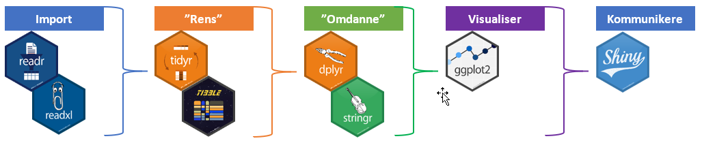

--- 
title: "Webinar R udvidet"
author: "Tue Hellstern"
date: "`r Sys.Date()`"
site: bookdown::bookdown_site
output: bookdown::gitbook
documentclass: book
bibliography: [book.bib, packages.bib]
biblio-style: apalike
link-citations: yes
github-repo: rstudio/bookdown-demo
description: "Webinar R udvidet"
---

# Introduktion
Dette webinar er for dig der gerne vil lidt videre med R.

## Workflow
Jeg har valgt at bassere dette webinar på et typisk workflow med brug af de forskellige funktioner i Tidyvers pakken.

Tidyvers pakke er valgt da den indholder alle de funktioner som du skal bruge for at komme igang med at lave dataanalyse i R. Det er nogle meget effektive funktioner pakken indeholder.

Dette workflow tager dig fra importen af dine data til en interaktiv præsentationen af dine data.